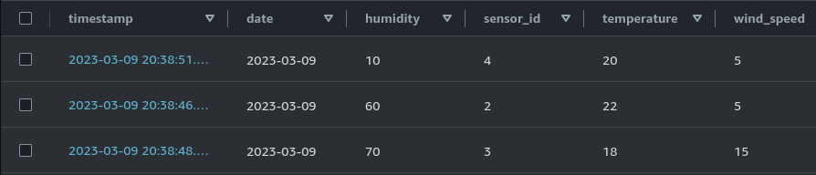
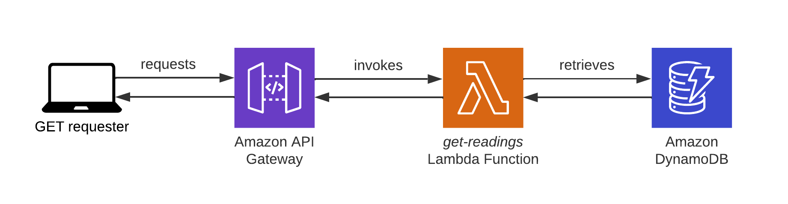
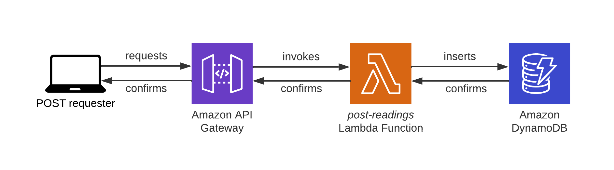

# REST API Documentation
This implementation was done with API Gateway, forwarding requests to AWS Lambda functions written in Python, which then reads and writes data to and from a DynamoDB table.`timestamp` is the unique(ish) ID for each reading and is the partition key for the table. `sensor_id` is the sensor that recorded the reading. `temperature`, `humidity`, and `pressure` are the readings from the sensor. 

*Example data is shown below* 


## GET Request
*The flow of a GET request is as follows:*


A reading's timestamp can be passed into a GET request with `timestamp=<timestamp>` to get one singular Reading.


### Querying Sensors
Sensors are identified by a single integer (for simplicity), and can be appended to the endpoint to get only results for each Sensor.

**Example**: `https://vcajt5jvr7.execute-api.us-east-1.amazonaws.com/Beta/weather-readings?sensor_ids=4,7`
The above example will return any weather readings for sensors 4 and 7. Single or multiple sensors can be queried at once, and if no sensor_id is specified, then all sensors will be included in the response. 

### Querying Metrics

Metrics can be queried using the metrics parameter in the GET request. Multiple metrics can be specified separated by commas.

**Example**: `https://vcajt5jvr7.execute-api.us-east-1.amazonaws.com/Beta/weather-readings?metrics=temperature,humidity`

The above example will return temperature and humidity metrics for all sensors.

### Querying Statistics

Statistics can be queried using the statistic parameter in the GET request. Valid options are min, max, sum, and mean. The default is mean.

**Example**: `https://vcajt5jvr7.execute-api.us-east-1.amazonaws.com/Beta/weather-readings?metrics=temperature,humidity&statistic=max`

The above example will return the maximum temperature and humidity readings for all sensors.

### Querying Time Ranges (unfinished)

Due to time (and not wanting to go over the suggested couple of hours) date ranges were not finished. This was going to work as setting a start_date and end_date and if the date of a reading fell into that range, it would be included in the response.

### Combining Queries

Queries can be combined to further refine the results. I recommend using Postman to test GETs, I ran into some issues when testing curl on another machine (to test API is accessible to public) and using Postman provided the expected results.

**Example**: `https://vcajt5jvr7.execute-api.us-east-1.amazonaws.com/Beta/weather-readings?sensor_ids=4,7&metrics=temperature,humidity&statistic=max`

The above example will return the maximum temperature and humidity readings for sensors 4 and 7.

Endpoint below to GET via Postman:
```
 https://vcajt5jvr7.execute-api.us-east-1.amazonaws.com/Beta/weather-readings?sensor_ids=4,7&metrics=temperature,humidity&statistic=max
```

Example response:
```
{
    "statusCode": 200,
    "body": "[\"temperature max: 30\", \"humidity max: 30\", \"Weather Reading timestamp 2023-03-09 20:38:51.295383\", \"Weather Reading timestamp 2023-03-09 14:54:55.127494\", \"Weather Reading timestamp 2023-03-10 14:30:38.214008\", \"Weather Reading timestamp 2023-03-09 12:59:54.519336\", \"Weather Reading timestamp 2023-03-09 15:07:23.426730\", \"Weather Reading timestamp 2023-03-09 20:41:05.865187\", \"Weather Reading timestamp 2022-01-01 15:07:25.815583\"]"
}
```

## Post Request

Below is an example POST request that a sensor would call in order to place a reading into the database. Timestamp is omitted as the Lambda calculates the current time. In theory, a sensor would record a reading which would immediately POST to the API so the timestamp would roughly reflect the time of the reading. Assuming no latency issues the difference would be negligible. 

Command below to POST via Postman or equivalent.
```
{
    "sensor_id": 1,
    "temperature": 23.4,
    "humidity": 0.5,
    "pressure": 1013.2,
}
```

Command below to POST via terminal
```
curl -X POST -H "Content-Type: application/json" -d '{"sensor_id": 4, "temperature": 20, "humidity": 10, "wind_speed": 5}' https://vcajt5jvr7.execute-api.us-east-1.amazonaws.com/Beta/weather-readings 
```